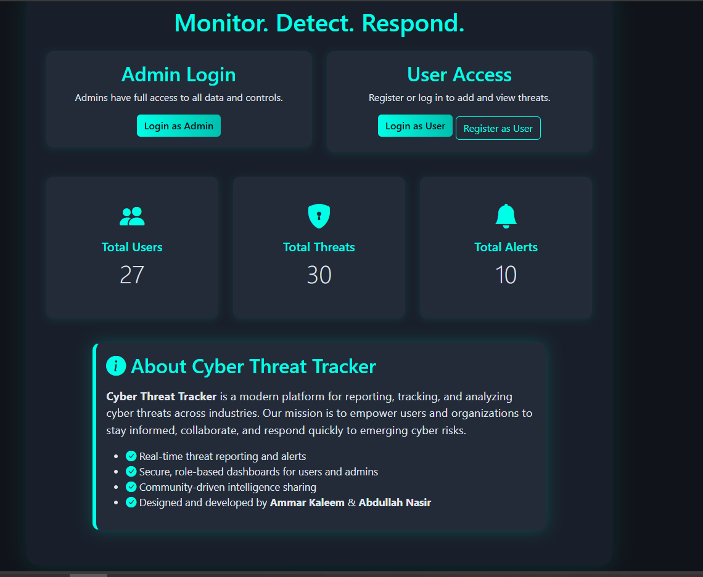

# 🛡️ Cyber Threat Tracker (Information Security Project)

A secure, enterprise-grade PHP web application meticulously engineered to track cyber threats, manage incident records, and dispatch real-time security alerts.

**Author:** [Muhammad Ammar Kalim](https://github.com/muhammadammarkalim)  
**Academic Focus:** Database Systems & Information Security Hardening

---

## 🔐 Core Security Implementation (Main Features)
This application was built primarily as a practical implementation of defensive programming, web security standards, and cryptographic data protection. The core architecture focuses heavily on mitigating the OWASP Top 10 vulnerabilities:

### 1. 🔑 Cryptography & Authentication
- **Bcrypt Password Hashing:** User and administrative credentials are never stored in plain text. The application utilizes PHP's `password_hash()` API with the robust **Bcrypt** algorithm to defend against rainbow table and brute-force decryption attacks.
- **Legacy Password Migration:** Includes a standalone utility (`migrate_passwords.php`) designed to securely upgrade legacy, weakly hashed database profiles to modern cryptographic standards without disrupting user records.

### 2. 🛡️ Web Security & Form Hardening
- **Anti-Cross-Site Request Forgery (CSRF) Protection:** Every state-changing form dynamically generates an unpredictable, cryptographically secure anti-CSRF token stored in the server session. Submissions are strictly validated against this token to block unauthorized cross-site actions.

### 3. 🛑 Defensive Coding (Input/Output Protection)
- **Cross-Site Scripting (XSS) Mitigation:** All incoming user data undergoes strict input validation. On the presentation layer, the application enforces Context-Aware Output Encoding (such as HTML escaping) to ensure malicious script injections are neutralized and safely rendered as plain text.

### 4. 🗄️ Database & Query Security
- **SQL Injection (SQLi) Prevention:** The database layer entirely prohibits raw string concatenation for user-supplied queries. All database transactions utilize **MySQLi Prepared Statements** and parameterized inputs, decoupling query logic from data handling.

### 5. 🍪 Session Hardening & State Management
- **Session Hijacking Defense:** Implements automated session ID regeneration (`session_regenerate_id()`) during privilege escalation points (like logging in) to prevent session fixation. Cookies are hardened using `HttpOnly` and `Secure` flags to block client-side script access.

### 6. 📊 System Monitoring & Auditing
- **Brute Force & Access Control Tracking:** A dedicated security subsystem acts as an application-layer audit log, tracking failed authentication spikes, anomalous privilege access attempts, and administrative record alterations inside specialized tracking tables.

---

## 🚀 Application Capabilities

### User Portal
- Self-registration and secure authentication pathways.
- Submit detailed threat intelligence profiles featuring attack vectors, metadata tags, and severity tracking.
- Search, filter, and dynamically query public incident databases.

### Administrative Command Center
- Strict Role-Based Access Control (RBAC) separating public users from security analysts.
- Full CRUD management tools to override threat levels, modify alerts, and evaluate network risk indices.
- Live administrative audit trail interface to actively monitor system state updates.

---

## 🔌 Required Software & Tools
To deploy and inspect this project locally, a standardized server stack is required. It is highly recommended to run **XAMPP**:

* **[Download XAMPP Installer](https://www.apachefriends.org/download.html)** (Includes Apache Web Server, PHP 8.x/9.x, and MariaDB/MySQL Database)
* Standalone configuration alternatives:
  - **[PHP Official Downloads](https://www.php.net/downloads.php)**
  - **[MySQL Community Server](https://dev.mysql.com/downloads/mysql/)**

## 🛠️ Technology Stack
- **Backend Infrastructure:** PHP
- **Database Engine:** MySQL / MariaDB
- **Frontend Architecture:** HTML5, CSS3, Vanilla UI Layouts
- **Local Web Environment:** Apache via XAMPP

---

## 📁 Critical Security & Source Files
- `security_functions.php` — Central security engine containing anti-CSRF generation, input sanitization, and session authorization checks.
- `migrate_passwords.php` — Database maintenance utility performing automated cryptographic hashing upgrades.
- `db_connect.php` — Isolated database entry portal utilizing secure configuration parameters.
- `add_security_tables.sql` — SQL migration schema defining auditing structures and access monitoring tables.
- `SECURITY_DOCUMENTATION.md` — Detailed architectural write-up explaining defensive choices.

## 📸 Interface Showcases
<p align="center">
  
  
</p>

---

## ✅ Deployment & Installation Guide

Follow these steps to set up the local hosting environment, configure the database schemas, and initialize the application tracking features:

### Step 1: File Deployment
Clone or copy this project repository directly into your local XAMPP web server directory:
```bash
C:\xampp\htdocs\cyberthreat-tracker
```

### Step 2: Initialize Web Services
Open your XAMPP Control Panel and click Start for both Apache and MySQL.

### Step 3: Base Database Schema Set Up
Open a command terminal or MySQL client and import the primary database schema:
```bash
mysql -u root < cyberthreat_db.sql
```

### Step 4: Inject Security Tracking Tables
Import the security schema to initialize the auditing and logging tables:
```bash
mysql -u root cyberthreat_db < add_security_tables.sql
```

### Step 5: Cryptographic Data Upgrades
Open your browser and run the migration tool:
```text
http://localhost/cyberthreat-tracker/migrate_passwords.php
```

### Step 6: Application Access
Open the main project page:
```text
http://localhost/cyberthreat-tracker/index.php
```

### Test Credentials
Use the following admin account to verify the installation and security features:
- **Username:** `zaib`
- **Password:** `zaib123`

### Project License
This repository is published under the terms of the open-source MIT License. See the included `LICENSE` file for full permissions and limitations.

Author: Muhammad Ammar Kalim

Engineered to fulfill Database Systems & Information Security framework benchmarks.
